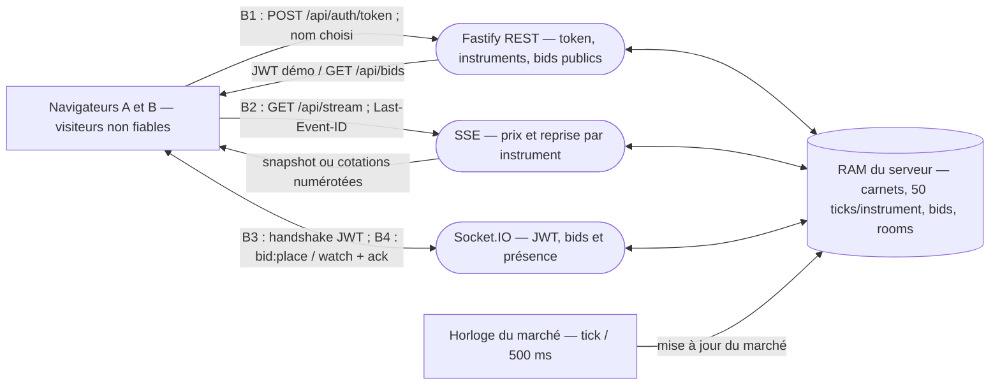

# Du DFD à EBIOS RM — cotations de marché (fiche de présentation)

Cette fiche applique **les cinq étapes de la diapositive du cours** à notre *simulation locale*, pas à Juice Shop. Le [modèle de menace détaillé](./threat-model.md) est la source ; les références `S1`, `D1`, etc. pointent vers ses lignes STRIDE. Pas de banque réelle, de base persistante, de comptes vérifiés ou d'étude EBIOS RM complète.

## 1. DFD : acteurs, processus, magasin, flux

**Acteurs** : deux visiteurs (le navigateur n'est pas fiable), plus l'horloge simulée interne. **Processus** : REST, SSE et Socket.IO dans **un même serveur**. **Magasin** : uniquement la RAM du processus, pas trois bases inventées. Les bids acceptés infléchissent le tick suivant ; le SSE ne publie pas de pseudonyme. Voir [les flux détaillés](./threat-model.md#2-dfd-du-service-réel).

## 2. Frontières de confiance : où la confiance change de main

| Frontière | Entrée non fiable → décision du serveur | Ce que cela ne garantit pas |
|---|---|---|
| **B1 navigateur → REST** | `username` : format contrôlé, puis JWT signé (`src/rest.ts`). `GET /api/bids` est public. | Aucun contrôle que le visiteur est réellement la personne nommée ; des pseudonymes de bids sont publiquement lisibles. |
| **B2 navigateur → SSE** | `instrument` parmi quatre symboles ; `Last-Event-ID`/`from` lu pour la reprise (`src/realtime/sse.ts`). | Pas de JWT ni de quota de connexions ; Origin/CORS n'est pas un contrôle d'accès à un client non navigateur. |
| **B3 handshake → canal Socket.IO ouvert** | Origin vérifié **s'il est fourni** ; JWT vérifié à l'entrée (`src/realtime/socketio/server.ts`). | L'Origin peut être omis hors navigateur ; expiration/révocation du JWT **non revérifiée** sur le socket déjà connecté. |
| **B4 canal accepté → RAM du marché** | `watch` exige un symbole connu ; `bid:place` valide instrument, prix, quantité, limite 10 messages/s **par socket** et déduplique les `requestId` non vides tant qu'ils sont en mémoire. | `requestId` vide accepté ; pas d'ACL par instrument (tous les quatre sont publics aux utilisateurs de la démo), ni de durabilité après redémarrage. |

## 3. STRIDE : un cas réel par catégorie

| Catégorie | Ligne et scénario concret | Bien menacé | Exigence tracée → état réel | H/M/L |
|---|---|---|---|---|
| **S — Spoofing (usurpation)** | **S1** : un visiteur demande un token au nom d'Alice puis place un bid attribué à Alice. | Attribution des bids, intégrité du prix (ER1). | Vérifier l'identité *avant* d'émettre le JWT → **absent** ; la clé JWT en dur a été corrigée, ce qui ne résout pas S1. | **H** |
| **T — Tampering (altération)** | **T2** : deux `bid:place` avec `requestId:''` créent deux bids au lieu d'un. | Unicité de l'offre et pression sur le prix (ER1). | Refuser l'ID vide et dédupliquer durablement si promis → **partiel**, cache RAM de 1 000 clés ; [preuve F5](./rapport-audit.md#f5--requestid-vide-contourne-la-déduplication-des-bids-ouvert-différé). | **M** |
| **R — Repudiation (contestation)** | **R1** : après un redémarrage, impossible de prouver durablement quel client a émis un bid. | Traçabilité des offres. | Journal/ack durable pour un vrai marché → **absent** ; les 100 derniers bids en RAM ne constituent pas un audit. | **M** |
| **I — Information disclosure (divulgation)** | **I1** : `GET /api/bids` expose sans JWT pseudonymes, prix et quantités des 30 derniers bids. | Confidentialité limitée des pseudonymes. | Informer et minimiser avant toute collecte réelle → **à traiter** ; [registre T-02](./registre-traitements.md#t-02--recevoir-et-afficher-les-bids-simulés). | **M** |
| **D — Denial of service (indisponibilité)** | **D1** : 20 connexions SSE anonymes simultanées sont acceptées, sans quota global/par source. | Continuité du flux (ER2). | Plafonner les connexions et mesurer les refus → **absent** ; 20 acceptations ne prouvent **pas** une panne. | **H** |
| **E — Elevation of privilege (dépassement des droits)** | **E1** : un JWT expiré est refusé à une nouvelle connexion, mais un socket déjà établi accepte encore `bid:place`. | Fin effective du droit d'agir (ER3). | Déconnecter ou revérifier à expiration → **absent** ; [preuve F4](./rapport-audit.md#f4--jeton-expiré-encore-autorisé-sur-le-socket-existant-ouvert-différé). | **H** |

Le reste du [tableau STRIDE (11 lignes)](./threat-model.md#3-stride-sur-les-frontières-et-les-flux) couvre Origin, paramètres de bid, chambres publiques et limites par socket. **L** n'est pas oublié : lire les cotations publiques (**I2**) et regarder les quatre rooms (**E2**) sont des *politiques intentionnelles*, pas des failles à « corriger » sans changer le besoin.

## 4. De la menace à l'exigence et à H / M / L

**Chaîne vérifiable** : entrée/flux du DFD → frontière B1–B4 → scénario STRIDE → bien + événement redouté → exigence → preuve de l'état → priorité. Exemple : `POST /api/auth/token` (B1) → **S1** → bid faussement attribué (ER1) → « authentifier avant émission » → [reproduction F1](./rapport-audit.md#f1--pseudonyme-choisi-librement-et-signé-comme-identité-ouvert-accepté-pour-la-démo) → **H**. La signature du JWT ne remplace pas cette exigence.

Les trois axes du [classement d'audit](./ADR-2-priorisation-audit.md) sont **impact sur le bien**, **exploitabilité** et **exposition** (chacun noté 1–3 ; produit 1–27). Dans le threat model, **H** signale un chemin exploitable avec impact important pour le sujet ; **M** un impact ou une exposition moindre ; **L** un accès voulu par la politique actuelle. Le **rang résiduel** de l'audit n'est pas le H/M/L initial : F2 (secret littéral) était dangereux, mais est désormais corrigé sur `main` ; F1 reste ouvert (**27**) et F3 suit (**18**). Ne pas annoncer qu'un risque est « accepté » sans rappeler qu'il bloque tout usage avec de vrais comptes ou exposition externe.

## 5. Passerelle STRIDE → événements redoutés EBIOS RM

| Menace H (technique, frontière) | Bien essentiel / événement redouté (métier) | Scénario source → chemin → impact | Statut |
|---|---|---|---|
| **S1**, B1/B3 | Attribution des bids et intégrité du cours → **ER1 (4/4)** : faux bid / prix trompeur. | Visiteur anonyme → token au nom d'Alice → handshake accepté → bid imputé à Alice → pression bornée sur le tick suivant. | Identité libre **ouverte**, secret en dur **corrigé** ; [preuve F1](./rapport-audit.md#f1--pseudonyme-choisi-librement-et-signé-comme-identité-ouvert-accepté-pour-la-démo). |
| **D1**, B2 | Continuité des cotations → **ER2 (3/4)** : flux indisponible. | Client anonyme → multiples SSE persistants → ressources potentiellement saturées → lecteurs privés de cotations. | Admission illimitée **ouverte** ; 20 flux observés, **aucune indisponibilité démontrée** ([F3](./rapport-audit.md#f3--flux-sse-anonyme-sans-quota-de-connexions-ouvert-accepté-en-local)). |
| **E1**, B3/B4 | Contrôle de l'attribution des bids → **ER3 (4/4)** : action après expiration. | Possesseur d'un JWT initialement valide → socket maintenu après expiration → bid encore accepté. | Expiration sur canal ouvert **différée** ; [preuve F4](./rapport-audit.md#f4--jeton-expiré-encore-autorisé-sur-le-socket-existant-ouvert-différé). |

**Distinction à dire à l'oral** : STRIDE classe les *modes d'attaque techniques* par flux ; le rapprochement EBIOS exprime **ce qui compte pour l'activité** (bien, événement, gravité) puis aide à choisir des exigences. Ce tableau est une **correspondance pédagogique**, pas une analyse EBIOS RM complète (pas d'ateliers d'écosystème, de sources de risque ou de scénarios stratégiques formalisés). Les preuves et les choix de traitement figurent dans le [rapport d'audit](./rapport-audit.md), pas dans un prétendu registre de risques bancaires.
