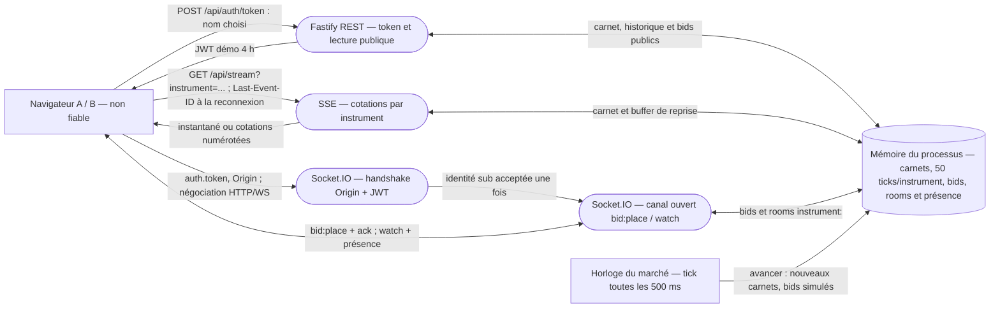

# Modèle de menace — cotations de marché (simulation locale)

Périmètre : le service effectivement lancé par `src/server.ts`, avec quatre instruments,
un processus Fastify et un état en mémoire. Les cotations sont publiques ; les bids et la
présence dans les rooms nécessitent un JWT de démonstration. Ni banque réelle, ni Redis,
ni base persistante, ni contrôle d'identité réel. Les références ci-dessous décrivent le
code actuel ; la preuve du secret initial est conservée dans l'historique Git. Vérifier ce document après chaque correctif. Les biens essentiels, événements redoutés et leur correspondance avec les menaces H sont documentés **séparément** dans [la passerelle EBIOS RM](./ebios-rm.md).

## 1. DFD du service réel

**Frontières de confiance :**

1. **Navigateur → HTTP REST** : le `username` est fourni par le visiteur et validé sur sa
   *forme*, pas sur son identité ; `/api/auth/token` signe sans mot de passe (`src/rest.ts`).
   Les endpoints de lecture et les cotations SSE sont volontairement publics.
2. **Navigateur → SSE puis connexion ouverte** : `instrument` est limité aux symboles connus ;
   `Last-Event-ID` ou `from` choisit seulement la réponse de reprise. Une connexion peut
   rester ouverte sans JWT et il n'existe ni quota de connexions ni limite de débit SSE
   (`src/realtime/sse.ts`). Les 50 derniers ticks sont en mémoire, pas durables.
3. **Navigateur → handshake Socket.IO → canal ouvert** : `allowRequest` vérifie l'Origin
   quand il existe et `io.use` vérifie le JWT à la connexion (`src/realtime/socketio/server.ts`).
   Après cette décision unique, `watch` et `bid:place` passent sur un canal durable :
   **expiration pendant la connexion : aucune nouvelle vérification ; autorisation de room :**
   tous les utilisateurs avec JWT peuvent regarder les quatre instruments, aucun ACL par
   instrument ni revérification à l'émission ; **retrait de droit :** aucun mécanisme de
   révocation n'avertit ni ne déconnecte un socket existant. Un client non navigateur peut
   omettre `Origin` (`src/realtime/origin.ts`) : ce n'est pas une authentification.
4. **Canal Socket.IO accepté → état partagé** : le serveur valide instrument, prix et quantité,
   puis enregistre le bid et calcule son effet sur le marché (`src/realtime/socketio/server.ts`,
   `src/store.ts`). Le limiteur est de 10 messages/s **par socket**, pas par personne ;
   l'idempotence par `requestId` ne dure qu'en mémoire, avec 1 000 entrées au maximum.

## 2. STRIDE sur les frontières et les flux

Chaque ligne trace un flux et sa frontière B1–B4 vers un scénario concret, une exigence de sécurité, l'état réel du contrôle et une priorité. **S1**, par exemple : `POST /api/auth/token` (B1) → nom choisi par un inconnu → exiger une authentification avant signature → identité non vérifiée → **H**. H = impact important et chemin exploitable dans cette simulation ; M = impact ou exposition moindre ; L = accès voulu par la politique de marché public. Les contrôles existants ne prouvent que leur périmètre indiqué ; les H/M/L du modèle technique ne sont pas les scores résiduels de [l'audit](./ADR-2-priorisation-audit.md).

| # | Élément / frontière | STRIDE | Scénario concret et limite du contrôle | Exigence / état | Priorité |
|---|---|---|---|---|---|
| S1 | REST token → handshake → bid, B1/B3 | Spoofing | `POST /api/auth/token` signe un `sub` choisi sans preuve d'identité. Au départ, `SECRET = 'change-moi'` permettait aussi de forger un JWT hors REST ; la clé actuelle est générée aléatoirement par processus, ou fournie via `JWT_SECRET`. Un JWT signé ne prouve toujours pas qui a choisi ce nom. | Authentifier réellement avant émission. **Partiel** : clé hors dépôt, identité démo non vérifiée. | H |
| S2 | Origin du handshake, B3 | Spoofing | `isAllowedOrigin` admet tout `localhost` et l'absence d'Origin ; un script peut en omettre un. | Origin strict pour navigateur, JWT vérifié séparément. **Partiel** : Origin n'est jamais une preuve d'identité. | M |
| T1 | `bid:place` → marché, B4 | Tampering | Un client choisit prix et quantité pour influer sur le prochain tick. | Valider instrument, prix, quantité et borner l'impact. **Présent** : `validerBid` et `calculerImpactBids` plafonnent l'effet, sans contrôler la légitimité de l'identité. | M |
| T2 | `requestId` d'un bid, B4 | Tampering | Une chaîne vide passe la validation mais n'est pas mémorisée dans `ajouterBid` ; deux soumissions peuvent créer deux bids. Après redémarrage ou éviction, la déduplication cesse aussi. | Identifiant non vide et déduplication persistante si exigée. **Partiel** : au plus 100 caractères, cache mémoire borné. | M |
| R1 | Bids acceptés, B4 | Repudiation | Un utilisateur conteste un bid ; il n'y a ni journal d'audit immuable ni preuve durable d'acquittement après redémarrage. | Traçabilité des commandes si nécessaire. **Absent** ; les 100 bids récents en mémoire ne sont pas un audit. | M |
| I1 | `GET /api/bids`, B1 | Information disclosure | Pseudonymes, prix et quantités des 30 bids récents sont accessibles sans token. | Décider si ces données doivent être publiques et minimiser les identifiants. **À arbitrer** dans le registre des traitements. | M |
| I2 | SSE par instrument, B2 | Information disclosure | Un anonyme lit les prix et le carnet des quatre instruments. | Politique : cotations publiques. **Intentionnel**, pas une fuite à corriger. | L |
| D1 | Flux SSE public, B2 | Denial of service | Un acteur ouvre beaucoup de connexions HTTP persistantes ; chaque client reçoit 2 mises à jour/s et des heartbeats, sans quota d'admission. | Plafond de connexions/débit et suivi de saturation. **Absent.** | H |
| D2 | Événements Socket.IO, B3/B4 | Denial of service | Plusieurs sockets portant le même JWT contournent la limite de 10 messages/s par socket. | Limite par identité/adresse si exposition externe. **Partiel** : `RateLimiter` par socket. | M |
| E1 | JWT → canal Socket.IO ouvert, B3 | Elevation of privilege | Le JWT de 4 h expire mais le socket déjà accepté continue à envoyer `bid:place` ; aucune révocation ni nouvelle vérification par message. | Expiration/révocation en cours de session. **Absente.** | H |
| E2 | `watch` → room, B3/B4 | Elevation of privilege | Tout utilisateur avec JWT peut rejoindre `instrument:<symbole>` parmi les quatre ; pas d'ACL par room. | Politique : tous les instruments sont regardables par tous les utilisateurs du prototype. **Intentionnel** ; à revoir si rooms privées. | L |

Les scénarios métier associés aux menaces H **S1, D1 et E1** figurent dans [la passerelle EBIOS RM](./ebios-rm.md#passerelle-depuis-les-menaces-stride-prioritaires). La remédiation, les exceptions et la priorité finale des findings sont une **décision distincte** : après tout correctif, mettre à jour la colonne « état » et conserver les preuves de l'état initial dans le [rapport d'audit](./rapport-audit.md).
